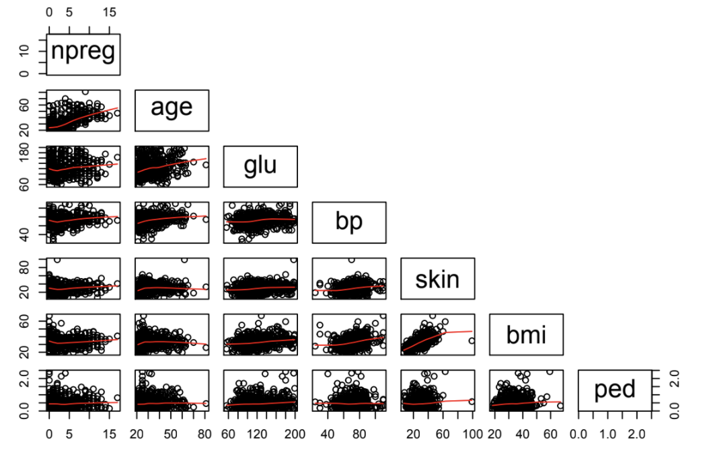
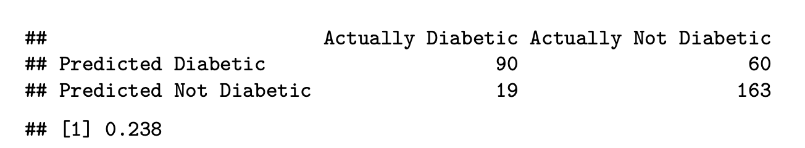

# PimaDiabetes

## Machine Learning Models for Detecting Diabetes in Pima Women

I worked with the Pima data set in library MASS for this project. The World Health Organization tested a population of women ages 21+ of Pima Indian descent for diabetes. Using the health information available in this data set, I trained and tested four different models (Lasso, Logistic Regression, Elastic Net, and Stepwise Generalized Additive Model) to try to accurately diagnose whether patients have diabetes or not while also accounting for the implications of misdiagnosis in this context.

## Motivation
Statistical modeling can be a helpful way to guide medical professionals in care, diagnosis, and treatment. Specifically, using machine learning to build models that recognize diabetes aids doctors in determining whether to run further testing on Hemoglobin A1c and fasting blood sugar, for example, and designing effective treatment plans for diabetic patients. If left untreated, diabetes can have severe and potentially lethal health consequences. These models work to distinguish between diabetic and non-diabetic patients while trying to minimize the number of Type II errors, in which we fail to diagnose diabetes in actually diabetic patients.

## Visualization


We consider each individual's number of pregnancies, age, concentration of glucose in their plasma, diastolic blood pressure, skin fold thickness in the triceps, body mass index, and diabetes pedigree in working to identify the patients with diabetes. This scatterplot matrix displays the pairwise relationships between the these measurements.

## Sample Code
See Rmd file for full project code.

```
# Stepwise GAM model
# Creating a GAM Object
Gam.object <- gam(type_num~npreg+glu+ped+age+bmi+bp+skin, data=Dtrain) 
step.object <- step.Gam(Gam.object, scope=list("npreg"=~1+npreg+s(npreg,2)+s(npreg,3)+s(npreg,4),
                                               "glu"=~1+glu+s(glu,2)+s(glu,3)+s(glu,4),
                                               "ped"=~1+ped+s(ped,2)+s(ped,3)+s(ped,4),
                                               "age"=~1+age+s(age,2)+s(age,3)+s(age,4),
                                               "bmi"=~1+bmi+s(bmi,2)+s(bmi,3)+s(bmi,4),
                                               "bp"=~1+bp+s(bp,2)+s(bp,3)+s(bp,4),
                                               "skin"=~1+skin+s(skin,2)+s(skin,3)+s(skin,4)))
# GAM Model Performance at optimal cut off of 0.32
preds.gam = predict(step.object, newdata = xvars.Dtest) # using the gam model from the training set to predict on the test set

actual <- yvars.Dtest
predicted <- ifelse(preds.gam > 0.32, 1, 0) # cut off at 0.32 

final.gam <- data.frame(actual, predicted)
names(final.gam) <- c("actual", "predicted")

cFM(final.gam) # See Rmd for the confusion matrix function I wrote
```



The stepwise GAM model manages to keep the number of false negatives low without sacrificing much in the way of the overall error rate, making it the best performing model, given our desire to balance accuracy and the minimization of Type II errors.

## Next Steps
To start, I would like to make use of AUC values and ROC plots to back up my decisions regarding the best cut off levels. More generally, I would like to expand the scope of these models to predict diabetes in wider populations than just the population of Pima women.

## Collaborators
Selin Gumustop, Williams College Class of 2020


